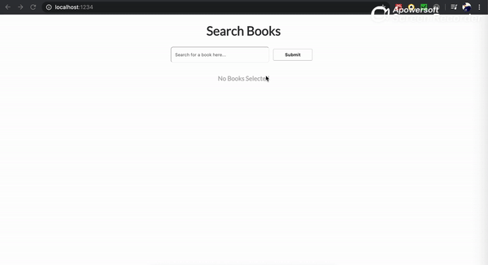

<b>Steps to run the project</b>

- Clone the repository
- goto search-engine-challenge folder
  - `cd search-engine-challenge`
- run `npm i` to download required packages
- run `npm run dev` to start the project on port `1234`
- run `npm test` to run all tests

  
